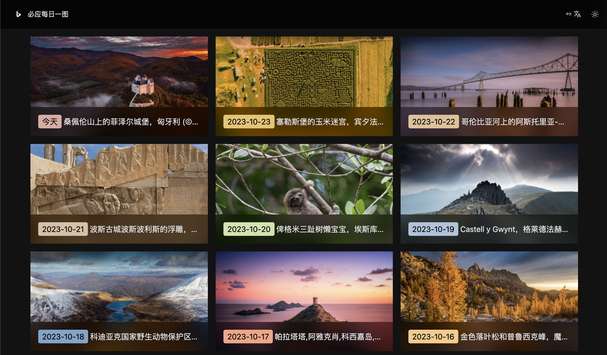
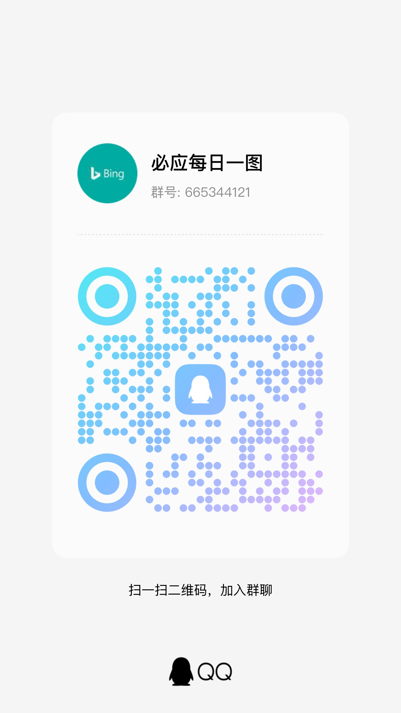

<div align="center">
  <h1>Bing Image of the Day</h1>
  <p>Updates with a new image daily (Source: Bing). As the poem goes: "Beyond the sunken ship, a thousand sails glide by." Let's explore the beauty of the world together!</p>
  <p>DEMO: https://bing.mcloc.cn</p>
</div>


### 1. Preview




### 2. Features

Bing Search updates with a high-quality image every day, making it perfect for wallpapers and giving you a fresh mood daily.

This project includes both frontend and backend, supports browsing past images, and provides several processed versions: thumbnails, Gaussian blur, and grayscale, along with HD and UHD versions.

To work seamlessly with [Pmage](https://github.com/androidmumo/pmage), the API also returns a tiny thumbnail in base64 format.

The server also extracts the dominant colors of the image, allowing the frontend to render beautiful pages using these colors.


## 3. Docker Deployment

This project provides a Docker version. You no longer need to worry about how to deploy the frontend and backend. Simply start the Docker image, and you'll have a service completely under your control.

Docker image: https://hub.docker.com/r/androidmumo/bing


#### 3.1. [Deploy on 1Panel](./doc/deploy.md)


#### 3.2. General Deployment Steps

Here are the general deployment steps for environments with Docker installed:

(1) Create a `config.js` file in a local directory (e.g., `data`) using the template below:

```javascript
// User configuration file config.js

// Basic Configuration
const baseConfig = {
  port: 3000, // Service startup port (default is 3000)
  updateTime: "00:01:00", // Daily update time (starts downloading images from Bing's official server at this time)
  DelayTime: 5, // Delay time (in minutes). The image for the day will only be displayed at 00:05:00. Increase this value for instances with lower performance (only applies to the '/api/getImage' endpoint)
  surviveDays: 90, // Image retention days (how many days to keep images before cleanup). 0 means no cleanup
  retryTimeout: 10000, // Error retry interval. Retries up to 10 times with increasing intervals; this specifies the initial interval (unit: ms)
  key: 'abcdefgh', // Authentication key. Used for endpoints that require authentication
};

// Website Info Configuration
const infoConfig = {
  link: [
    {
      label: "Baima Konggu's Homepage", // Link name
      url: "https://www.mcloc.cn/" // Link URL
    },
    {
      label: "Baima Konggu's Blog",
      url: "https://blog.mcloc.cn/"
    }
  ],
  copyright: `Copyright © 2020-2025 mcloc.cn@Baima Konggu. All Rights Reserved.`, // Copyright info
  htmlSlot: {
    beforeFooter: ``, // HTML slot above the footer
    afterFooter: `<a style="margin-right: 10px;" target="_blank" href="https://beian.miit.gov.cn/">Jin ICP Bei 20001086-1</a>
  <a style="margin-right: 10px; display: flex; align-items: center;" target="_blank" href="http://www.beian.gov.cn/portal/registerSystemInfo?recordcode=41080202000141">
    
    <span>Henan Public Security Network Security Record 41080202000141</span>
  </a>` // HTML slot below the footer
  }
}

module.exports = {
  baseConfig,
  infoConfig,
};

```

(2) Mount directory: Local directory (`data`) > Container directory (`/usr/src/app/data`). Images and the built-in SQLite database will be saved here. Please ensure proper persistence and backup.

If you need to migrate old MySQL data, place the `.sql` file generated by `mysqldump` into this local directory before starting the container. The container will automatically import it on startup and delete the SQL file upon success; failed files will be retained.

(3) Map ports: Local port (e.g., 80) > Container port (default is 3000)

(4) Start the container.


Now, visit `[Your Server IP]:[Your Local Port]` to see the frontend page.

Additionally, you may need to perform extra server configurations, such as opening firewall ports, setting up a reverse proxy, etc.

To access the API, please refer to the [Server Documentation](./server/README.md).

Upon container startup, the program will automatically fetch and process today's image. The page you see might be empty initially. Don't worry, just wait a moment (depending on your server's performance), and once the image is processed, refresh the page to view it.


### 4. Other Documentation

#### 4.1. [Server Documentation](./server/README.md)

#### 4.2. [Frontend Documentation](./client/README.md)


### 5. Sponsorship & Feedback

#### 5.1. Sponsorship

Sponsors are invited to join the core user group (WeChat group). Please contact QQ: 619874503 after sponsoring.

Afdian: https://afdian.com/a/bingImage

Thanks to the following sponsors:

Ajiro, Afdian User_58Gh


#### 5.2. QQ Group

Group Number: 665344121


