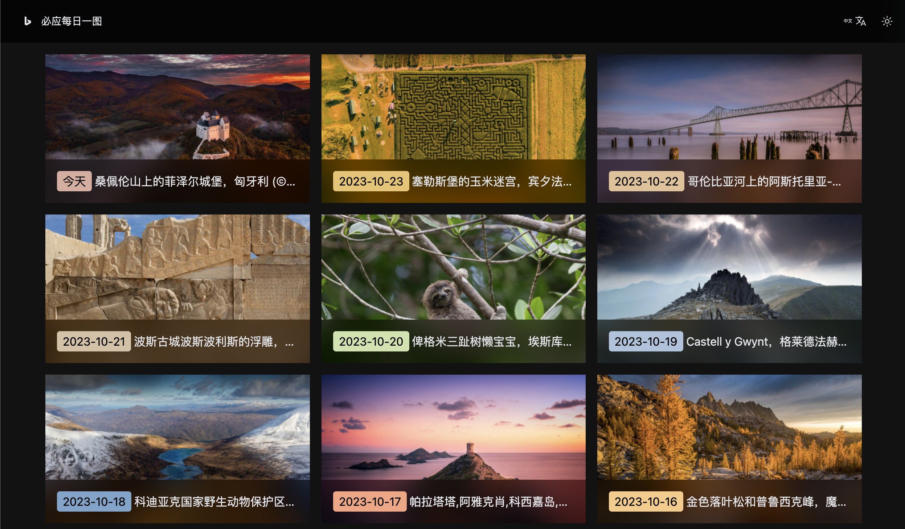

<div align="center">
    <h1>必应每日一图（前端）</h1>
    <p>每天更新一张图片（来源：必应）。诗曰：沉舟侧畔千帆过。一起来领略世界之美吧！</p>
    <p>DEMO（基于此仓库实时部署）: https://bing.mcloc.cn</p>
</div>


### 预览




如果您想 **二次开发**/**自行部署** 必应每日一图前端页面，那您来对地方了，请继续。


### 安装依赖

- 请确保您的Node版本为16及以上
- 推荐使用pnpm包管理器，版本推荐pnpm@8

```
pnpm
```


### 本地开发调试

```
pnpm dev
```


### 编译

```
pnpm build
```


### 其他

您可能希望改用自建接口，它在 `src/utils/http.ts` 下被指定。

您想要更改的大部分内容应该位于 `src/pages`（页面）和 `src/style` （样式）这两个目录。


### 计划

- [ ] 支持日期查询
- [ ] 支持搜索


### 或许您想看看

或许您注意到了，本项目使用了图片渐进加载，以实现从高斯模糊的缩略图到原图的平缓过渡，改善用户体验。

在老版的必应每日一图中，我使用了指令式的插件：`v-progressive-image`。

但现在我开发了新的插件，它更强大：`pmage`。

原理：缩略图会被优先下载，使用户先看到一张高斯模糊的缩略图；当原图加载完成时，再平滑过渡到高清图片，这便是渐进加载。

这是一个意外收获，希望它也能给您带来便利。

如果您想试试这个插件，请看：

https://github.com/androidmumo/pmage