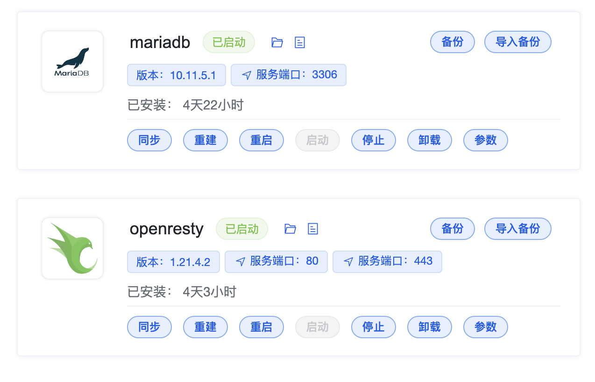
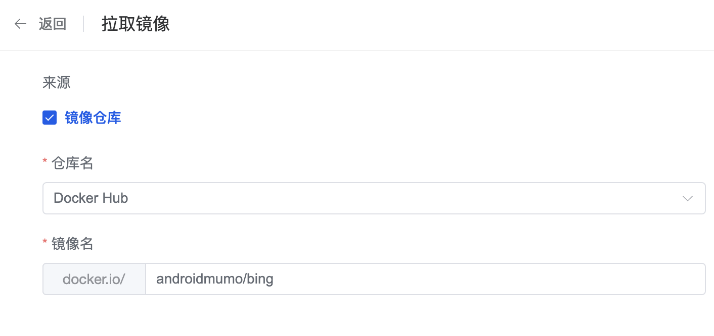
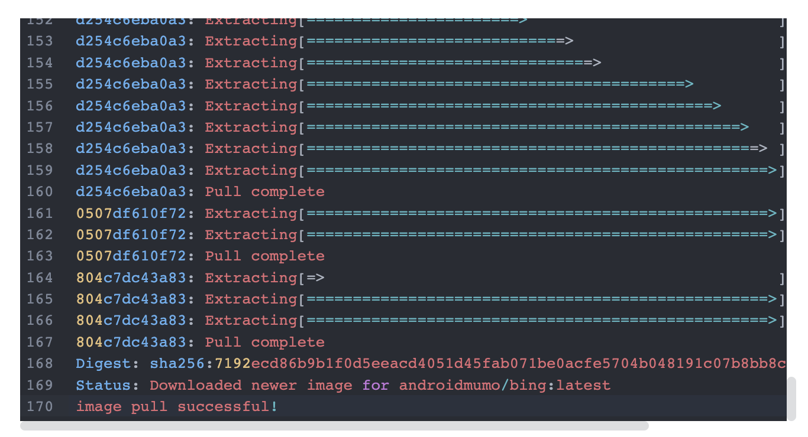
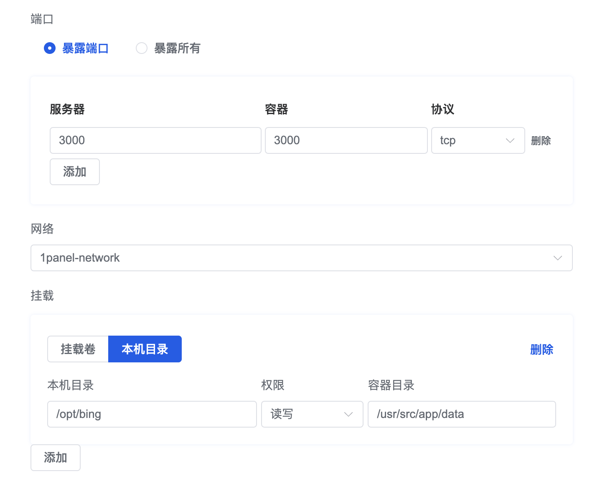
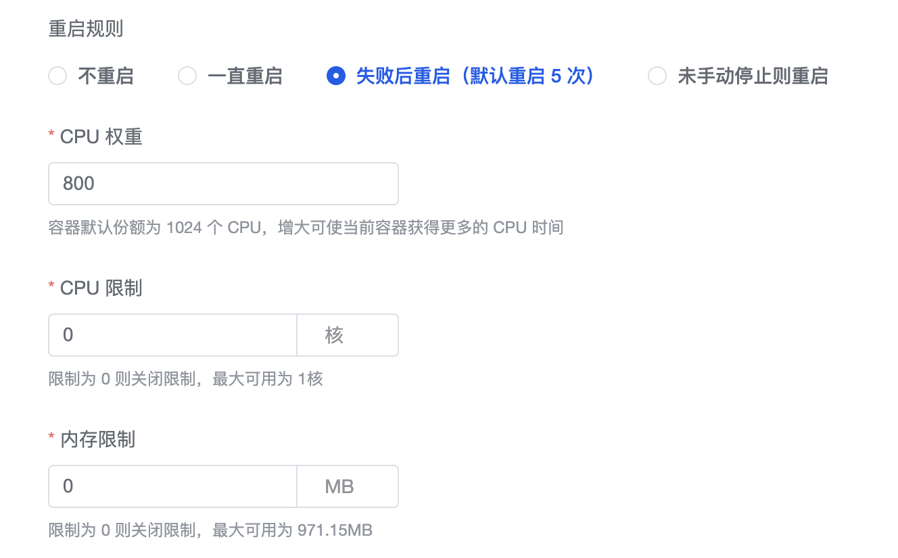
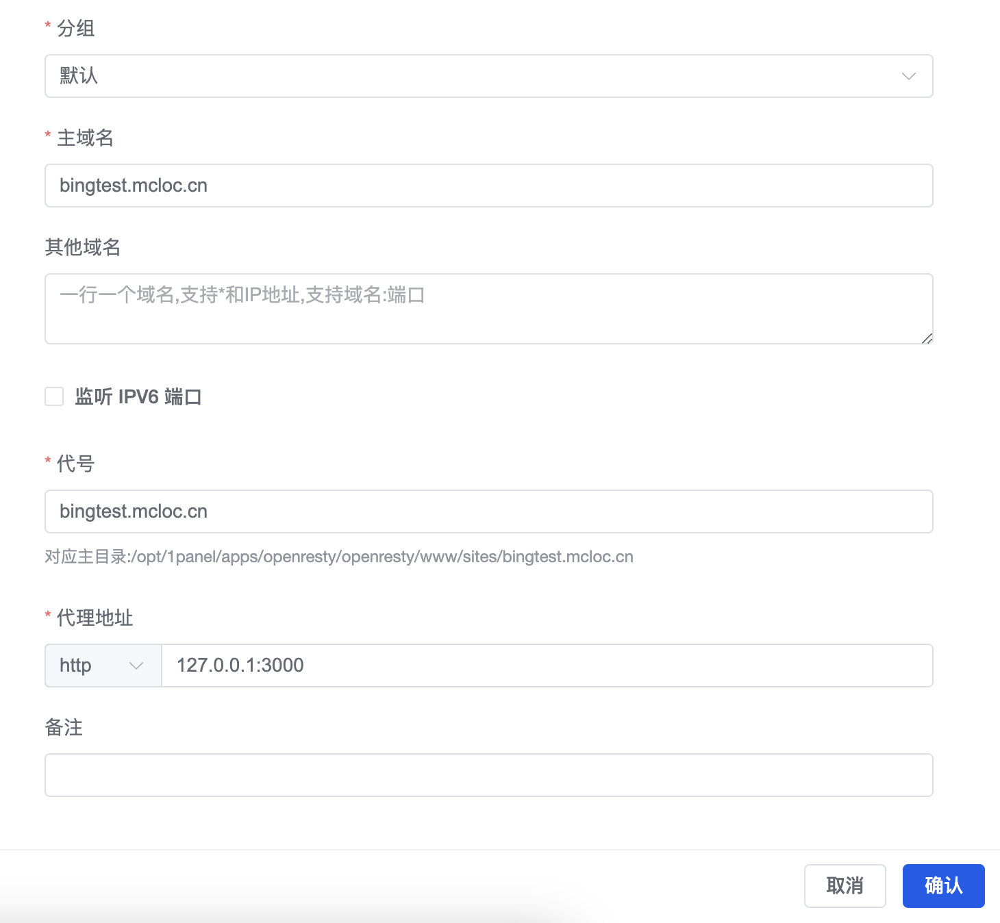

# 部署


### 在1Panel上部署必应每日一图


1Panel是一个以容器为核心的Linux运维管理面板，可以帮助我们便捷的部署必应每日一图。

当然，您也可以用其他支持Docker的环境进行部署，这里以1Panel为例。


#### 环境准备

我们现在假设你有一个可用的1Panel面板。首先登录1Panel面板（成文时1Panel版本为v1.7.4），进入【应用商店】，安装 `OpenResty` 和 `MariaDB` 。



OpenResty 是一个基于 Nginx 的高性能 Web 应用服务器，可以帮我们创建反向代理网站。数据库除了可以选用MariaDB外，还可以选用MySQL等兼容的数据库。

数据库安装好后，进入1Panel的【数据库】，点击【创建数据库】。根据提示新建一个数据库，保存数据库名、数据库用户名、数据库密码备用。

需要注意的是，在容器中连接此数据库用的地址不是 `127.0.0.1:3306` ，而是 `mariadb:3306` ，点击1Panel数据库管理页面的【连接信息】可以看到详细信息。连接地址也保存备用。


#### 目录及配置文件准备

在创建容器之前，我们需要新建一个目录，用于存放图片以及配置文件。

进入1Panel的【主机】-【文件】，在 `/opt` 目录下新建文件夹 `/bing` （当然，您可以选择其他位置，只要有可写权限即可）。然后新建一个空白的 `config.js` 文件，将 [config-full.js](https://github.com/androidmumo/bing/blob/main/server/data/config-full.js) 中的内容复制到此文件中。

现在，您需要用保存备用的数据库连接信息，修改此配置文件，各配置项的含义已经标明，请填写正确。

这里把文件的内容贴到下方：

```javascript
// 用户配置文件 config.js

// 基础配置
const baseConfig = {
  port: 3000, // 服务启动端口号
  updateTime: "00:01:00", // 每天更新时间 (开始从必应官方服务器下载图片的时间)
  DelayTime: 5, // 延迟时间（分钟） 即每天00:05：00的时候才显示当天的图片。性能较差的实例应适当调大此值 (仅针对'/api/getImage'接口)
  surviveDays: 90, // 图片存活天数（即图片保存多少天，到期即清理） 0为不清理
  retryTimeout: 10000, // 错误重试间隔。共重试10次，每次间隔时间递增，这里指的是首次间隔时间 (单位:ms)
  key: 'abcdefgh', // 鉴权密钥。用于需要鉴权才能访问的接口
};

// 数据库配置 (注意：除数据库连接池大小外，以下配置项提及的内容需在安装前准备好并填入)
const databaseConfig = {
  host: "mariadb", // 数据库链接地址
  port: "3306", // 数据库连接端口
  database: "bing", // 数据库名
  user: "bing", // 数据库用户名
  password: "bing", // 数据库密码
  connectionLimit: 100, // 数据库连接池大小
};

module.exports = {
  baseConfig,
  databaseConfig,
};
```


#### 拉取镜像

我们现在假设你已经完成了环境准备、目录及配置文件准备。现在进入Panel的【容器】-【镜像】，点击【拉取镜像】。

勾选【镜像仓库】，仓库名选择【Docker Hub】，然后在镜像名中输入必应每日一图的容器名：`androidmumo/bing` 。



最后点击下方的【拉取】按钮，稍等片刻。当出现下方提示时，代表镜像已经拉取成功了。




#### 创建容器

镜像拉取完成后，我们进入到1Panel的【容器】-【容器】，点击【创建容器】。

名称这里随意填。

镜像选择我们刚刚拉取的 `androidmumo/bing:latest` 。


端口部分选择【暴露端口】，服务器端口和容器端口均填写 `3000` ，协议选择tcp。

网络部分选择任一bridge网络，如 `1panel-network` 即可。

挂载部分选择【本机目录】，本机目录填写刚刚新建的目录 `/opt/bing` ，权限为读写，容器目录请填写 `/usr/src/app/data` 。



重启规则和性能限制依据个人需要配置，建议选择【失败后重启】。



其余部分保持默认即可，点击【确认】，开始创建容器。

容器创建成功后应该是类似这个样子的：


#### 设置反向代理（可选）

如果一切顺利的话，完成以上步骤，并开放防火墙的3000端口后，你的必应每日一图服务就已经跑在3000端口了。

但是访问时要加一个3000端口不太优雅，我们可以利用OpenResty新建一个反向代理网站，代理地址选择本机的3000端口即可，即 `127.0.0.1:3000` 。




#### 问题反馈

感谢您的阅读，如果有任何问题，欢迎您提issue反馈，或者加入我们的QQ交流群：665344121